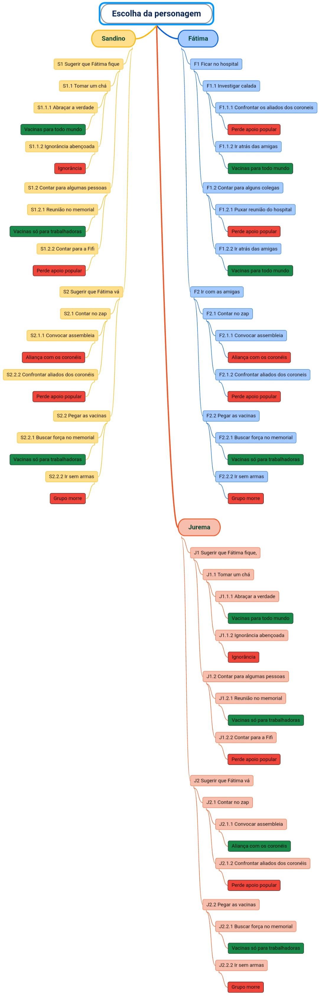

Projeto final do módulo 1 da [Turma VamoAI](https://github.com/serenozin/turmaVamoAi)
# TEJUCUPAPO, grupo 6

Estamos na comunidade de Tejucupapo, a comunidade já perdeu 2 anciãs 
para o novo vírus que circula pelo mundo. E nessa semana chegaram as vacinas 
suficientes para imunizar 70% da população do local. Mas os coronéis 
roubaram todas as doses, e a população está recebendo placebo. Fátima, 
enfermeira no Hospital Elizabete Altino Teixeira vem desconfiando 
disso há um tempo, e resolveu compartilhar sua teoria com suas amigas 
Sandino, a ativista; e Jurema, a encantada. Para você ganhar o jogo a 
comunidade precisa ter acesso integral à vacina. Incluencie o grupo para
tomar as melhores decisões, que lhe levarão à vitória.

### Personagens 

- Fátima
- Sandino
- Jurema

### Cenários:

- Hospital Elizabete Altino Teixeira
- Quintal da Jurema
- Memorial das Heroínas de Tejucupapo

### Condições de Vitória: 

- Apenas trabalhadoras e trabalhadores terem acesso à vacina
- Todos da comunidade terem acesso às vacinas, inclusive os não trabalhadores aliados  dos coronéis

### Condições de Derrota: 

- Aderir à ignorância
- Perder o apoio popular
- Aliança com os coronéis
- Morrer

### Como jogar:
Clone esse repositório e rode na sua máquina, ou  clique [aqui](https://repl.it/talk/share/JogoResilia/126593) para jogar via Repl.it!
## Fluxograma dos caminhos possíveis:

## CONFIRA OS OUTROS PROJETOS DO GRUPO 6

[VACIKIDS](https://github.com/D20go/JogoResilia) |
[APOCAVID 19](https://github.com/turquetti/JogoResilia) |
[JACARÉ MUTANTE](https://github.com/tsffarias/JogoResilia)

